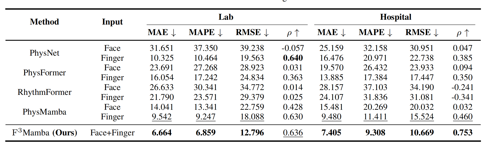
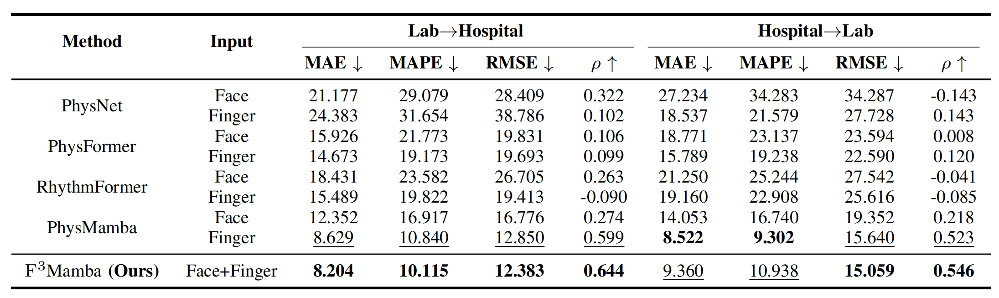

# $\mathrm{M}^3\text{PD}$ Dataset: Enabling Dual-View Photoplethysmography on Smartphones in Lab and Clinical Settings

[](https://www.python.org/)
[](https://pytorch.org/)
[](LICENSE)

---

## Abstract
Portable physiological monitoring is essential for early detection and management of cardiovascular disease, but current methods often require specialized equipment that limits accessibility or impose impractical postures that patients cannot maintain. Video-based photoplethysmography on smartphones offers a convenient non-invasive alternative, yet it still faces reliability challenges caused by motion artifacts, lighting variations, and single-view constraints. Few studies have demonstrated that this technology can be reliably applied to physiological monitoring of cardiovascular patients, and no widely used open datasets exist for researchers to examine its cross-device accuracy. To address these limitations, we introduce the $\mathrm{M}^3\text{PD}$ dataset—the first publicly available dual-view mobile rPPG dataset—comprising synchronized facial and fingertip videos captured simultaneously via front and rear smartphone cameras from 60 participants (including 47 cardiovascular patients). Building on this multi-view setting, we further propose the $\mathrm{F}^3\text{Mamba}$ framework, which effectively integrates complementary physiological signals across views using temporal-difference Mamba blocks and a fusion Mamba architecture. Our framework achieves significantly improved heart-rate estimation accuracy (MAE reduction of 21.9--30.2\%) compared with state-of-the-art approaches, while also showing enhanced robustness in challenging real-world conditions.


## 📁 Dataset

### $\mathrm{M}^3\text{PD}$ 
The dataset comprises synchronized physiological data from 60 participants across two collection environments:

#### Lab Environment
- **Participants**: 13 healthy volunteers
- **Setting**: Controlled laboratory conditions
- **Duration**: ~15 minutes per session

#### Clinic Environment  
- **Participants**: 47 cardiovascular patients
- **Setting**: Clinical environment
- **Duration**: ~15 minutes per session
  
#### Dataset Organization

```
📁 LabDataset/
├── 📁 1/
│   ├── 📁 DualCamera_<timestamp>/
│   │   ├── 🎥 front_camera_<timestamp>.mp4           # Facial video recording
│   │   ├── 🎥 back_camera_<timestamp>.mp4            # Fingertip video recording
│   │   ├── 📊 front_camera_data_<timestamp>.txt     # Facial video timestamp data
│   │   └── 📊 back_camera_data_<timestamp>.txt      # Fingertip video timestamp data
│   └── 📁 1_spO2_rr_data/v01/
│       ├── 💓 BVP.csv                                # Ground truth Blood Volume Pulse
│       ├── ❤️ HR.csv                                 # Ground truth Heart Rate
│       ├── 🫁 RR.csv                                 # Ground truth Respiration Rate
│       ├── 🩸 SpO2.csv                               # Ground truth Blood Oxygen Saturation
│       └── ⏰ frames_timestamp.csv                   # Temporal synchronization data
├── 📁 2/
│   └── ... (similar structure)
├── ...
└── 📁 13/

```

#### Data Modalities
- **📹 Front Camera**: Facial video for remote photoplethysmography (rPPG)
- **📹 Back Camera**: Fingertip video for contact-based PPG
- **💓 Physiological Labels**: BVP, HR, RR, SpO2, Blood Pressure

#### Technical Specifications
| Modality | Specifications |
|----------|---------------|
| **Video Resolution** | 128×128 pixels |
| **Frame Rate** | 30 FPS |
| **Sequence Length** | 160 frames (5.33 seconds) |
| **Data Format** | PyTorch tensors (.pth files) |


## 🏗️ F³Mamba Architecture
The **F³Mamba** framework is designed to effectively integrate complementary physiological signals from dual-camera smartphone recordings. Our architecture leverages the power of Mamba blocks for long-range temporal dependency modeling while introducing novel fusion mechanisms for multimodal integration.


## 📊 Benchmarks

### intra-dataset experiments

The table shows Mean Absolute Error (MAE), Root Mean Square Error (RMSE), and Pearson correlation coefficient performance of 3-fold cross-validation experiments on Lab and Hospital datasets:



### cross-dataset experiments

The table shows generalization performance when training on Lab dataset and testing on Hospital dataset:




## 💻 Examples of Data Processing
### Basic Data Loading

```python
from Process.data_process import MultimodalDataLoader
import config

# Initialize configuration
args = config.get_config()

# Load Lab dataset
lab_loader = MultimodalDataLoader(config=args)
lab_loader.dataset_name = "Lab_multimodal"
lab_loader.save_datasets("./ProcessedDataset")
```
### Data Structure

```python
# Sample data structure
sample = {
    "modals": {
        "video_front": torch.Tensor,    # [seq_len, H, W, 3] - Facial video
        "video_back": torch.Tensor,     # [seq_len, H, W, 3] - Fingertip video  
    },
    "labels": {
        "bvp": torch.Tensor,           # [seq_len] - Blood Volume Pulse
        "hr": torch.Tensor,            # [seq_len] - Heart Rate
        "rr": torch.Tensor,            # [seq_len] - Respiration Rate
        "spo2": torch.Tensor,          # [seq_len] - Blood Oxygen Saturation
    }
}
```


## 💻 Examples of Network Training

### Single-Modal Training

```python
from Models.PhysMamba import PhysMamba
from Models.RhythmFormer import RhythmFormer
from Process.Trainer import Trainer

# Initialize single-modal model
args.modal_used = ["front"]  # or ["back"]
args.video_backbone = "PhysMamba"  # or "RhythmFormer", "PhysNet"

if args.video_backbone == "PhysMamba":
    model = PhysMamba(theta=0.5, drop_rate1=0.25, drop_rate2=0.5, frames=args.seq_len)
elif args.video_backbone == "RhythmFormer":
    model = RhythmFormer()

# Setup training
trainer = Trainer(model, args)
trainer.train(train_loader, val_loader)
```

### Multi-Modal Fusion Training

```python
from Models.F3Mamba import F3Mamba

# Configure fusion training
args.modal_used = ["front", "back"]
args.modal_fusion_strategy = "F3Mamba"

# Initialize fusion model
model = F3Mamba(args)

# Training with multiple GPUs
trainer = Trainer(model, args)
trainer.train(train_loader, val_loader)
```
