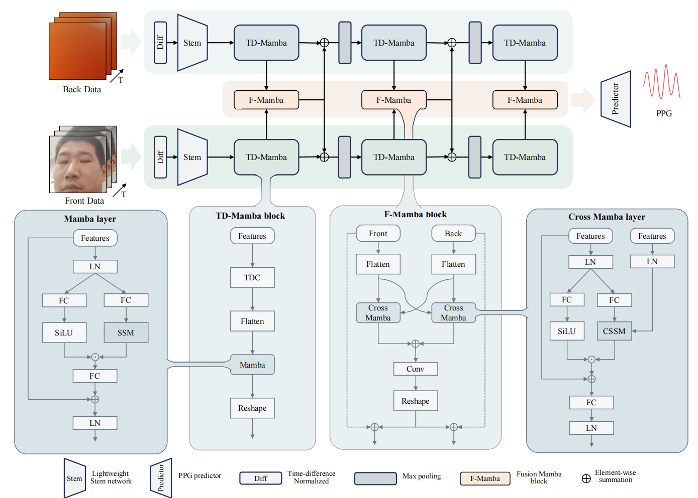

# Dual-Camera Fusion for Robust Video-Based Photoplethysmography on Smartphones

[](https://www.python.org/)
[](https://pytorch.org/)
[](LICENSE)

> ❤️ **Please remember to ⭐ this repo if you find it useful and cite our work if you end up using it in your work!** ❤️
> 
> ❤️ **If you have any questions or concerns, please create an issue 📝!** ❤️

---

## Abstract

Continuous physiological monitoring is essential for early detection and management of cardiovascular conditions, but current methods require specialized equipment that limits accessibility. Video-based photoplethysmography (rPPG) via smartphones offers a promising non-invasive alternative, yet suffers from reliability challenges due to motion artifacts, lighting variations, and single-modality constraints. To address these limitations, we introduce the $\mathrm{M}^3\text{PD}$ dataset—the first publicly available dual-camera mobile rPPG dataset—comprising synchronized facial and fingertip videos captured simultaneously via front and rear smartphone cameras from 60 participants (including 47 cardiovascular patients). This dataset uniquely represents real-world mobile health monitoring scenarios, including handheld device movement and varying clinical conditions. Based on this multimodal approach, we propose the $\mathrm{F}^3\text{Mamba}$ framework, which effectively integrates complementary physiological signals across modalities using temporal difference Mamba blocks and a novel fusion Mamba architecture. Our framework achieves significantly improved heart rate estimation accuracy (MAE reduction of 21.9-30.2\%) compared to state-of-the-art approaches, with enhanced robustness in challenging real-world conditions. These advances demonstrate the clinical potential of smartphone-based vital sign monitoring for point-of-care assessment and remote patient monitoring.

## 📁 Dataset

### $\mathrm{M}^3\text{PD}$ 
The dataset comprises synchronized physiological data from 60 participants across two collection environments:


#### Lab Environment
- **Participants**: 13 healthy volunteers
- **Setting**: Controlled laboratory conditions
- **Duration**: ~15 minutes per session

#### Hospital Environment  
- **Participants**: 47 cardiovascular patients
- **Setting**: Clinical environment
- **Duration**: ~30 seconds per session
  
#### Dataset Organization

```
📁 Lab_Environment/
├── 📁 1/
│   ├── 📁 DualCamera_<timestamp>/
│   │   ├── 🎥 front_camera_<timestamp>.mp4           # Facial video recording
│   │   ├── 🎥 back_camera_<timestamp>.mp4            # Fingertip video recording
│   │   ├── 📊 front_camera_data_<timestamp>.txt     # Facial video timestamp data
│   │   └── 📊 back_camera_data_<timestamp>.txt      # Fingertip video timestamp data
│   └── 📁 1_spO2_rr_data/v01/
│       ├── 💓 BVP.csv                                # Ground truth Blood Volume Pulse
│       ├── ❤️ HR.csv                                 # Ground truth Heart Rate
│       ├── 🫁 RR.csv                                 # Ground truth Respiration Rate
│       ├── 🩸 SpO2.csv                               # Ground truth Blood Oxygen Saturation
│       └── ⏰ frames_timestamp.csv                   # Temporal synchronization data
├── 📁 2/
│   └── ... (similar structure)
├── ...
└── 📁 13/

```

#### Data Modalities
- **📹 Front Camera**: Facial video for remote photoplethysmography (rPPG)
- **📹 Back Camera**: Fingertip video for contact-based PPG
- **💓 Physiological Labels**: BVP, HR, RR, SpO2, Blood Pressure

#### Technical Specifications
| Modality | Specifications |
|----------|---------------|
| **Video Resolution** | 128×128 pixels |
| **Frame Rate** | 30 FPS |
| **Sequence Length** | 160 frames (5.33 seconds) |
| **Data Format** | PyTorch tensors (.pt files) |


## 🏗️ F³Mamba Architecture
The **F³Mamba** framework is designed to effectively integrate complementary physiological signals from dual-camera smartphone recordings. Our architecture leverages the power of Mamba blocks for long-range temporal dependency modeling while introducing novel fusion mechanisms for multimodal integration.



## 📊 Benchmarks

### intra-dataset experiments

The table shows Mean Absolute Error (MAE), Root Mean Square Error (RMSE), and Pearson correlation coefficient performance of 3-fold cross-validation experiments on Lab and Hospital datasets:


### cross-dataset experiments

The table shows generalization performance when training on Lab dataset and testing on Hospital dataset:


## 🔧 Setup
```bash
# Clone the repository
git clone https://github.com/your-username/vPPG-Fusion.git
cd vPPG-Fusion

# Create conda environment
conda create -n vppg-fusion python=3.8
conda activate vppg-fusion

# Install dependencies
pip install -r requirements.txt
```

## 💻 Examples of Data Processing
### Basic Data Loading

```python
from data_process import MultimodalDataLoader
import config

# Initialize configuration
args = config.get_config()

# Load Lab dataset
lab_loader = MultimodalDataLoader(config=args)
lab_loader.dataset_name = "Lab_multimodal"
lab_loader._test_save_datasets()
```
### Data Structure

```python
# Sample data structure
sample = {
    "modals": {
        "video_front": torch.Tensor,    # [seq_len, H, W, 3] - Facial video
        "video_back": torch.Tensor,     # [seq_len, H, W, 3] - Fingertip video  
    },
    "labels": {
        "bvp": torch.Tensor,           # [seq_len] - Blood Volume Pulse
        "hr": torch.Tensor,            # [seq_len] - Heart Rate
        "rr": torch.Tensor,            # [seq_len] - Respiration Rate
        "spo2": torch.Tensor,          # [seq_len] - Blood Oxygen Saturation
    }
}
```


## 💻 Examples of Network Training

### Single-Modal Training

```python
from Models.PhysMamba import PhysMamba
from Models.RhythmFormer import RhythmFormer
from Process.Trainer import Trainer

# Initialize single-modal model
args.modal_used = ["front"]  # or ["back"]
args.video_backbone = "PhysMamba"  # or "RhythmFormer", "PhysNet"

if args.video_backbone == "PhysMamba":
    model = PhysMamba(theta=0.5, drop_rate1=0.25, drop_rate2=0.5, frames=args.seq_len)
elif args.video_backbone == "RhythmFormer":
    model = RhythmFormer()

# Setup training
trainer = Trainer(model, args)
trainer.train(train_loader, val_loader)
```

### Multi-Modal Fusion Training

```python
from Models.F3Mamba import F3Mamba

# Configure fusion training
args.modal_used = ["front", "back"]
args.modal_fusion_strategy = "F3Mamba"

# Initialize fusion model
model = F3Mamba(args)

# Training with multiple GPUs
trainer = Trainer(model, args)
trainer.train(train_loader, val_loader)
```


## Citation

If you find this work useful, please cite our paper:

```bibtex
@article{tang2025dual,
  title={Dual-Camera Fusion for Robust Video-Based Photoplethysmography on Smartphones},
  author={Jiankai Tang, Tao Zhang, Jia Li, Yiru Zhang, Mingyu Zhang, Kegang Wang, Yuming Hao, Bolin Wang, Haiyang Li, Yuanchun Shi, Yuntao Wang, and Sichong Qian},
  journal={arxiv},
  year={2025}
}
```

## 📄 License

This project is licensed under the MIT License - see the [LICENSE](LICENSE) file for details.

## 🤝 Contributing

We welcome contributions! Please feel free to submit pull requests or create issues for bugs and feature requests.

---

⭐ **Star this repo if you find it helpful!** ⭐
